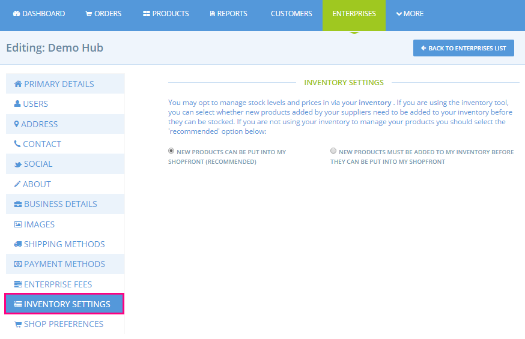
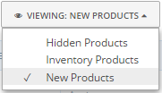
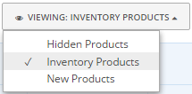
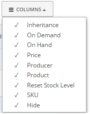
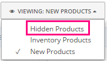

# L'Outil Inventaire

## Introduction

L'"inventaire" offre aux entreprises plus de contrôle et de flexibilité dans la gestion de leurs produits, si elles le souhaitent. Cette fonctionnalité intéressera principalement les hubs et les gestionnaires de hubs.&#x20;

En utilisant l'"Inventaire", le hub A peut modifier le prix et les niveaux de stock des articles qu'il est autorisé à vendre au détail. Cette fonction peut également permettre au hub A de ne mettre en vente sur sa vitrine qu'une sous-sélection de produits provenant de ses producteurs fournisseurs, s'il ne souhaite pas distribuer des gammes entières de produits. Tout cela peut être fait sans modifier la copie maîtresse des produits. Par conséquent, si les hubs A et B stockent les mêmes produits, le hub A peut, à l'aide de l'outil d'inventaire, modifier le prix et d'autres informations fondamentales sur les articles qu'il vend sans que cela ait un impact sur le hub B.

## Paramètres d'Inventaire

Pour accéder à l'inventaire, allez dans Entreprises (dans le menu horizontal bleu) et ensuite dans "Paramètres". Dans la barre de menu située à gauche, sélectionnez "Paramètres de l'inventaire".

Vous avez alors deux options:

* **De nouveaux produits peuvent être ajoutés à ma vitrine (recommandé)** : Les produits de vos fournisseurs peuvent être ajoutés à votre vitrine en ligne _sans que vous ayez à les ajouter au préalable dans l'inventaire de votre boutique/hub_. Lorsque vous créez un cycle de commande, _tous_ les produits des producteurs sélectionnés seront disponibles pour que vous les ajoutiez à la partie " entrante " du cycle de commande. Il s'agit de l'option par défaut et elle est recommandée pour les hubs qui ne souhaitent pas modifier les prix ou les niveaux de stock des articles qu'ils vendent au détail.


ATTENTION : si vous conservez vos paramètres d'inventaire dans ce mode "désactivé" par défaut, mais que vous téléchargez en même temps des produits dans l'inventaire de votre hub et que vous modifiez leurs prix ou leurs niveaux de stock, les informations modifiées seront affichées sur la façade de votre boutique, et non dans la copie principale.


* **Les nouveaux produits doivent être ajoutés à mon inventaire avant de pouvoir être ajoutés à ma vitrine** : Lorsque vous créez un cycle de commande, seuls les produits que vous avez précédemment ajoutés à l'inventaire du hub pourront être sélectionnés dans la partie "arrivée" du cycle de commande.

## Visionner l'Inventaire de votre Boutique/Hub

Cliquez sur le menu **Produits** en haut de votre tableau de bord d'administration, puis cliquez sur **Inventaire** dans le sous-menu vert. Si vous gérez plusieurs entreprises, il vous sera demandé d'en sélectionner une car chaque inventaire est géré indépendamment.

Si de nouveaux produits ont été ajoutés par vos fournisseurs entre chaque visite de l'inventaire de votre boutique/magasin, vous verrez le message suivant :

Tant que vous n'aurez pas ajouté ces produits à l'inventaire, ils resteront dans la catégorie "**Nouveaux produits**" et ne pourront pas être sélectionnés lors de la création d'un cycle de commande. En cliquant sur "**Consulter maintenant**", vous serez redirigé vers la liste des nouveaux produits.

## Reviewing New Products

Les nouveaux produits peuvent être soit **Ajoutés** à votre inventaire, soit **masqués**. S'il existe un produit dans la liste pour lequel vous souhaitez modifier les détails ou appliquer un niveau de stock récurrent, vous devez l'**ajouter** à votre liste d'inventaire. S'il existe un produit que vous ne voulez jamais vendre dans votre boutique, ou du moins que vous ne voulez pas stocker dans un avenir proche, vous pouvez choisir de le **masquer** (voir la section **Produits** masqués ci-dessous).


N'oubliez pas que si vos **paramètres d'inventaire** sont définis de telle sorte que "les nouveaux produits doivent être ajoutés à mon inventaire avant de pouvoir être placés dans ma vitrine", tous les produits que vous laissez dans la liste des nouveaux produits seront cachés. Si vos paramètres d'inventaire sont définis sur "les nouveaux produits peuvent être placés dans ma vitrine", les produits de votre liste de nouveaux produits apparaîtront toujours dans votre cycle de commande.


## Gérer les Produits dans l'Inventaire

La liste des produits de votre inventaire est l'endroit où vous pouvez remplacer les détails des produits, configurer la réinitialisation des niveaux de stock et masquer les produits.

Grâce au bouton "colonnes" situé à droite du tableau, vous pouvez choisir les paramètres que vous souhaitez voir et modifier.

### Modifiez les numéros de référence, les prix et les niveaux de stock des produits de votre vitrine.

Toute modification effectuée ici sera visible sur votre boutique et remplacera donc les détails définis par le fournisseur. Vous pouvez modifier les champs suivants :

* **Numéro de référence** - si vous souhaitez utiliser un autre numéro de référence pour un produit, vous pouvez remplacer le numéro de référence du producteur en saisissant un autre numéro.&#x20;
* **Prix** - Vous pouvez définir un prix différent à afficher dans votre boutique. N'oubliez pas que les unités du produit restent les mêmes. Par conséquent, si le prix du produit est fixé au kilogramme, vous pouvez uniquement modifier son coût au kilogramme et non le transformer en un coût fixe par article.&#x20;
* **En stock** - Si votre stock de ce produit diffère du stock disponible proposé par les producteurs, vous pouvez indiquer votre stock. Vos produits ne seront plus visibles dans la boutique lorsque le niveau de stock atteindra zéro.


Cela peut être pratique si vous recevez un achat en gros de 50 articles par mois, et que vous devez suivre leurs ventes avant la prochaine livraison.&#x20;


* **Illimité ?** - Vous pouvez choisir d'hériter des niveaux de stock du producteur (dans ce cas, le nombre dans la colonne "en stock" restera gris), d'avoir un stock illimité "oui" (donc l'article ne sera jamais épuisé et sera toujours disponible, s'il est ajouté à un cycle de commande actif) ou de définir vos propres niveaux de stock "non" (dans ce cas, le nombre dans la colonne "en stock" sera sur fond blanc).

Rappelez-vous les termes "en stock" et "illimité" ici.


Il n'est pas possible de modifier le nom, les propriétés, la description ou l'image du produit.


### Activer la Réinitialisation du Stock ?

La colonne "**activation de la réinitialisation du niveau de stock**" vous permet de réinitialiser le montant "En stock" à une valeur par défaut, par exemple au début de chaque nouveau cycle de commande. Le **montant par défaut** est le nombre saisi dans cette colonne à côté de la case à cocher. La case à cocher vous permet de sélectionner uniquement les articles que vous souhaitez réinitialiser à un moment donné.&#x20;

Pour réinitialiser le stock par défaut pour ces produits, cliquez sur "Actions" en haut à gauche du tableau d'inventaire, puis sur "Réinitialiser les niveaux de stock par défaut". Seuls les produits pour lesquels la case permettant la réinitialisation du stock a été cochée seront affectés par cette action.

> Dans cet exemple, le niveau de stock par défaut des fèves au lard est de 5. Il en reste actuellement 2 en stock. Si l'utilisateur, au début d'un cycle de commande, souhaite revenir à 5, il doit cliquer sur "Réinitialiser les niveaux de stock par défaut" sous "Actions".


Il s'agit d'une fonctionnalité utile pour les hubs qui peuvent recevoir des livraisons de produits spécifiques une fois par mois ou selon un calendrier régulier.


### Hériter?

Si vous n'avez modifié aucune des valeurs de la table d'inventaire d'un produit, la case à cocher "hériter ?" sera, par défaut, cochée. Cela signifie que les informations saisies par le producteur et visibles en gris s'afficheront sur votre vitrine.

En modifiant un ou plusieurs des champs, cette case à cocher sera automatiquement décochée. Pour réinitialiser les valeurs (prix, stock, numéro de référence, etc.) aux valeurs de l'exemplaire original du producteur, vous pouvez à tout moment cocher à nouveau cette case.

### Masquer

Comme dans la liste des **nouveaux produits**, vous pouvez également **masquer** des produits de votre **inventaire**. En cliquant sur le bouton "Masquer", le produit sera déplacé vers votre liste de **produits cachés**. Si votre profil d'inventaire est configuré comme suit : "**Les nouveaux produits doivent être ajoutés à mon inventaire avant de pouvoir être ajoutés à ma vitrine**" (voir ici), le produit que vous venez de masquer ne pourra plus être sélectionné dans le cycle de commande de votre hub et ne sera donc pas visible sur votre vitrine.

## Produits Masqués

La liste des produits que vous avez décidé de masquer se trouve ici :&#x20;

Lorsque vous consultez votre liste de produits cachés, vous pouvez choisir de les rendre visibles en cliquant sur le bouton "**Ajouter**" à droite de l'article.

## Inventaire et Cycles de Commande

Lorsque vous configurez des cycles de commande, vous pouvez, au cas par cas, choisir de sélectionner tous les produits disponibles ou seulement ceux qui se trouvent dans l'inventaire de votre boutique/hub.&#x20;

Pour ce faire, il suffit de cliquer sur "Paramètres avancés" (en haut à droite de la page du cycle de commande) :

Cette option a le même effet que la modification des paramètres de notre profil d'entreprise pour votre inventaire, mais contrairement à cette dernière, elle ne s'applique qu'au cycle de commande en question.


Après avoir apporté des modifications, n'oubliez pas de cliquer sur "Mettre à jour" ou "Enregistrer" avant de continuer !

